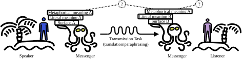

# Metaphor Preservation in Machine Translation and Paraphrasing

This repository contains code and data for an [essay accompanied with experiments](https://vilda.net/papers/metaphor_preservation.pdf), which focused on metaphor preservation in machine translation and automatic paraphrasing.

> <b>Abstract:</b> Metaphors play a crucial role in human communication.
> Improving the handling of metaphors in NLP will enhance the quality and accuracy of cross-lingual communication, benefiting various applications such as multilingual chatbots, localization, and cross-cultural understanding.
> This paper reports an evaluation that focuses on the analysis of metaphor presence and preservation in machine-translated and paraphrased texts.
> The results suggest that textual language models do not have access to the metaphorical meaning and do not fully understand this literal device.
> They are not sensitive to the subtle differences between various paraphrases but can be used for the rudimentary analysis of machine translation output, which varies greatly with respect to metaphor preservation.

<figure>
    
    <figcaption><b>Figure 1</b>: Transmitting meaning of a message while having to change the surface-level text form. The messenger is possibly an agent who may not understand language and have access to the metaphorical meaning. Two things need to be checked: (1) <i>is the metaphor still there?</i> and (2) <i>is the meaning of the metaphor the same?</i></figcaption>
</figure>

 
 
 

The paper is typeset in [Typst](https://github.com/typst/typst), which is still in experimental stages.